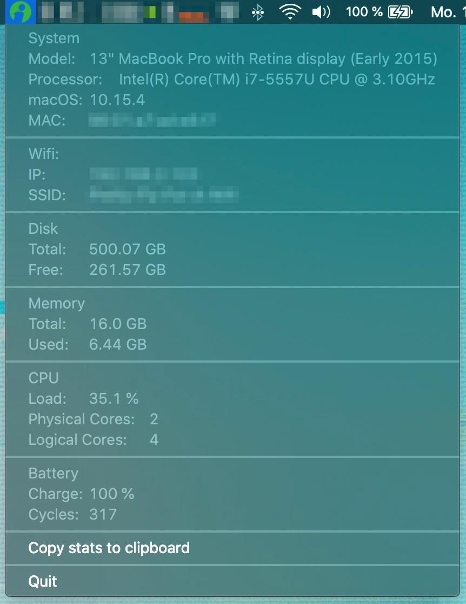
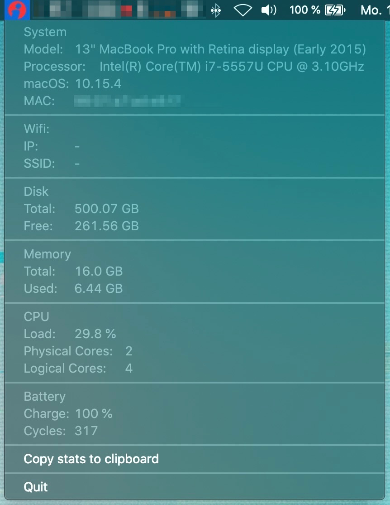

# macStats


A simple macOS menu bar app, that displays all the relevant info about your Mac - built on top of [rumps](https://github.com/jaredks/rumps)

---

## Getting started

### Screenshots

 
<br/>

### Prerequisites

macStats only runs on `macOS`. Furthermore, you need an installation of `Python3` on your machine.

### Dependencies

Packagemanagement for this project has been done with [pipenv](https://github.com/pypa/pipenv). With pipenv installed, you only have to run `pipenv install` to install all dependencies from the `Pipfile`. To start up the virtual environment, just run `pipenv shell`.

Without pipenv, install the dependencies as follows:

```python
pip install rumps py2app netifaces psutil
```

### Usage

The idea behind macStats is to bundle all the necessary info about your Mac in one place and with that, replacing an abundance of terminal commands, settings pages and other apps. It's mainly for displaying information, so there's not much interactivity to it.

The only button - `Copy stats to clipboard` - will copy a string to your clipboard, that contains the following data:

```
Model: -
Processor: -
macOS: -
MAC-address: -
RAM: -GB
Internet-connection: True/False

```

This button is meant to make aksing questions online about your Mac easier. When searching for a solution to a certain problem, it is of utmost importance to give all the relevant information and context for people to be able to solve your problem. Well, the info about your hardware is taken care of.
